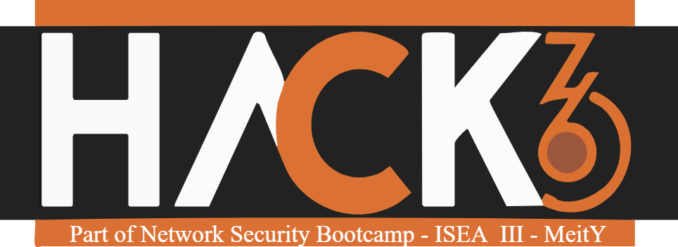

# Hack36

  
   
  <h1>Hack36 8.0</h1>
  <h3>36 Hours of Innovation and Creation</h3>

  
  

## Meet Our Mascot - Milo

  
  
<i>Meet Milo, your coding companion for Hack36 8.0!</i>

Hack36 is MNNIT Allahabad's annual hackathon, bringing together innovators, developers, and problem-solvers for a thrilling 36-hour coding marathon.

## Event Details

* **Location**: MNNIT Allahabad
* **Duration**: 36 Hours
* **Format**: In-person hackathon

### What to Expect
* Tech talks
* Workshops
* Networking opportunities
* Exciting surprises
* Real-world problem solving
* Collaborative environment

## Resources

* [Code of Conduct](Code_Of_Conduct.pdf)
* [Event Brochure](Hack36_Brochure.pdf)

## Contributing

Feel free to contribute to this repository by submitting pull requests or creating issues.

## License

© 2025 Hack36 | MNNIT Allahabad. All rights reserved.
